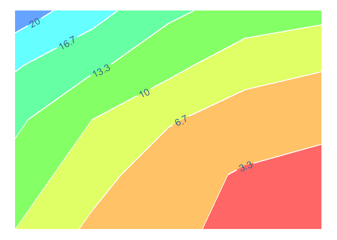

# PositConf2023_Schedule_Viewer

HEYYYY! This is the code I used to create the most chaotic Google
Calendar of all time containing all events at Posit Conf 2023.

Quick explainer video in lieu of an actual ReadMe
[here](https://youtu.be/XzHaBQR4DB0)

Below is an example of using a Quarto document rendered to gfm format to
turn it into your GitHub README!

## Example Header

Here’s a fun bit of code that creates a contour plot, which I then turn
into a rainbow!

``` r
z = matrix(c(10, 12, 14, 17, 22,
             6, 8, 10, 14, 18,
             4, 4.5, 7, 11, 14,
             2.5, 3, 5, 8, 12,
             2, 2.5, 4, 7, 11),
           nrow=5, ncol=5)

df <- expand.grid(x = seq(ncol(z)), y = seq(nrow(z)))
df$z <- as.vector(z)

ggplot(df, aes(x, y, z = z)) +
  geom_contour_filled(bins = 7, 
                      alpha = 0.6) +
  geom_textcontour(bins = 7, 
                   size = 5,
                   linewidth = .75,
                   linecolor = "white",
                   straight = TRUE, 
                   color = "steelblue4") +
  scale_fill_manual(values = rainbow(10)) +
  theme_void() +
  coord_flip() +
  theme(legend.position = "none")
```


